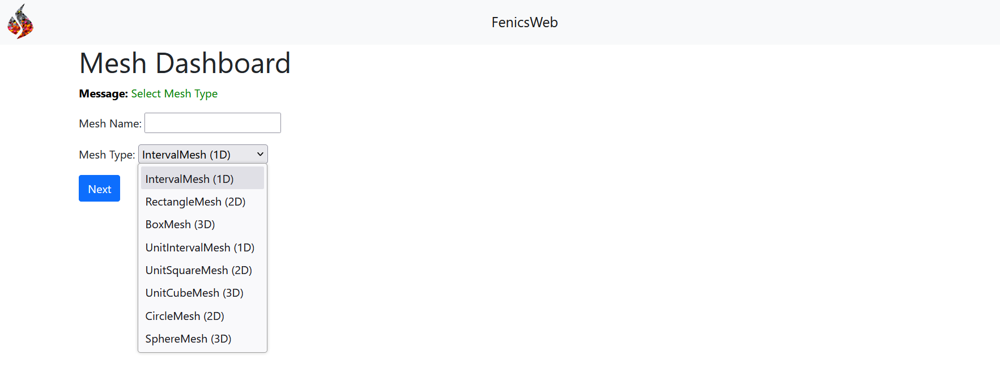
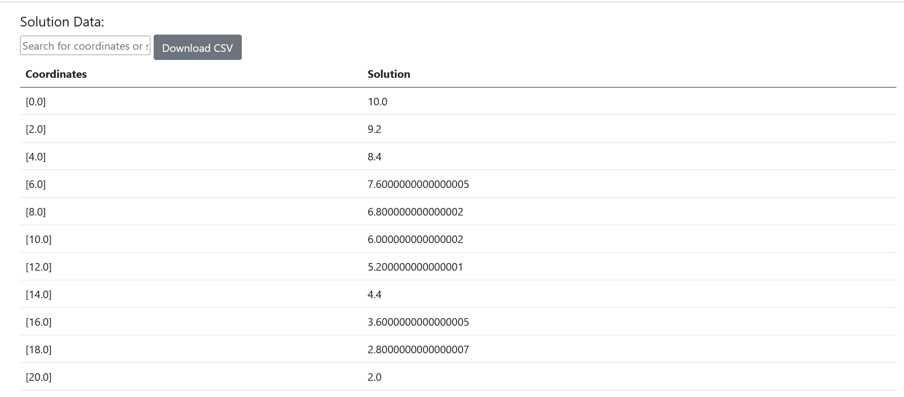

# Abstract

This ``FEniCSWEB`` project presents a powerful computation initiative for solving numerical analysis problems (like Finite Element Analysis and Computational Fluid Dynamics) using FEniCS integrated with Django. The application provides a web-based interface for engineers, researchers, and students to define, generate and analyze finite element models of thermal systems. For the initial phase of this work, I created a solver for 1D, 2D, and 3D Steady State Thermal Conduction Problems. The solver module employs the finite element method (FEM) to solve the governing heat conduction equation, incorporating user-defined thermal conductivity, boundary conditions, and heat source terms. Static visualization of both mesh structures and computed temperature distributions is provided using Matplotlib to get detailed insights into the thermal behavior of the system. The application stores all the data like mesh and solutions, which allows users for future reuse and retrieval. The application is designed to be open-source to serve as a foundational tool for educational purposes and research. The combination of FEniCS and Django bridges the gap between advanced numerical analysis and accessibility for non-experts.

# Statement of need

The Existing finite element analysis (FEA) softwares (like Ansys, Abaqus) often requires expensive licenses and extensive training. Many Open Source FEA tools have deep learning curves, making them challenging for beginners; it is not so user friendly for non-experts. This project simplifies the process by a web interface, allowing users to easily define problems, set boundary conditions, and visualize results. By leveraging Django and FEniCS, this project combines advanced numerical analysis with web platforms.

# Design and Development

For the initial phase this project only focused on the steady state thermal conduction problem. This project development is split into two modules 1. Mesh Generation Module, 2. Solver module. 


## a. Mesh Generation Module:
The Django form is created to enable users to define domains (meshes) with various geometries such as intervals, rectangles, and cubes. Use FEniCS for mesh generation based on user input and create visualizations using Matplotlib for plot and the mesh data storage in the database for reuse. The mesh module is routed into ``http://127.0.0.1:8000/mesh/`` which we can generate meshs like ```IntervalMesh (1D), RectangleMesh (2D), BoxMesh (3D), UnitIntervalMesh (1D), UnitSquareMesh (2D), UnitCubeMesh (3D)```


### 1D Mesh


### 2D Mesh

### 3D Mesh


## b. Solver Module:
Developed a Python-based solver using FEniCS to compute the temperature field ``(u)`` by solving the steady-state heat conduction equation:

``−∇⋅(k∇u)=f`` in the domain 

``u=u0`` on Dirichlet boundaries

Forms are implement for users to specify boundary conditions, material properties, and heat sources which assemble and solve the finite element equations and visualization the solution. Visualization using Matplotlib to visualize Generated meshes and their properties, Computed temperature distributions and heat flux vectors. It provides both PNG visualization and detailed result repect to the coordinates.

### Problem Statement
The heat equation we solve is:

``-Δu = f   in Ω,``

with the boundary condition:

``u =uD  in ∂Ω``

where:

``Δu`` is the Laplace operator (second derivative).

``f`` is the source term.

``uD``​ is the prescribed temperature on the boundary (∂Ω).

The Steady State Thermal Conduction Solver is routed to ``http://127.0.0.1:8000/SteadyStateThermal/``

### 1D Mesh

For the 1D problem it have only ``2 boundaries`` put ``zero`` for rest of the fields. These boundaries are ``Dirichlet boundaries``; the ``Neumann boundaries`` will be update in next version.




### 2D Mesh


### 3D Mesh


#### Note
- For the boundary value temperature refers with the unit of ``°C`` Celsius then use ``(W/m-°C)`` watts per meter per degree Celsius
- For the boundary value temperature refers with the unit of ``K`` Kelvin then use ``(W/m·K)`` watts per meter Kelvin
- For the insulated boundary and unrequired boundary fields just put ``zero``

# Future Work
- Implementation of custom domain (Mesh)
- Implementation of other thermal problems (Convection and Radiation) and boundaries (Neumann and Robin)


# References
- Mats G. Larson  Fredrik Bengzon, “The Finite Element Method: Theory, Implementation, and Applications”, DOI 10.1007/978-3-642-33287-6, Springer Heidelberg New York Dordrecht London
- Hans Petter Langtangen • Anders Logg, “Solving PDEs in Python The FEniCS Tutorial I”, DOI 10.1007/978-3-319-52462-7, Simula SpringerBriefs on Computing 
- Anders Logg • Kent-Andre Mardal • Garth N. Wells, “Automated Solution of Differential Equations by the Finite Element Method”, DOI 10.1007/978-3-642-23099-8, 2011 The FEniCS Project.
- https://docs.fenicsproject.org/dolfinx/v0.9.0/python/demos.html
- https://jsdokken.com/dolfinx-tutorial/
- https://docs.djangoproject.com/en/5.1/
